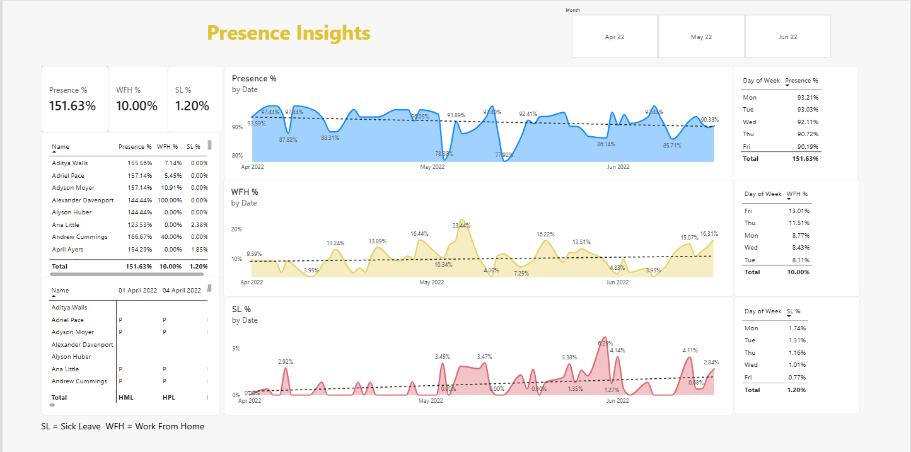

# Employee Presence Analytics Dashboard

## 📊 Project Overview

This project analyzes employee attendance and workplace presence
using Microsoft Power BI.

The dashboard provides insights into:

- Employee presence percentage
- Work From Home (WFH) percentage
- Sick Leave (SL) percentage
- Daily presence trends
- WFH trends
- Sick leave trends
- Day-of-week attendance patterns
- Individual employee attendance

## 🛠️ Tools Used

- Microsoft Power BI
- DAX
- Microsoft Excel
- Data Cleaning
- Data Visualization

## 📈 Dashboard

## 🔍 Key Features

### Presence Analysis
Tracks employee presence percentage over time.

### WFH Analysis
Shows Work From Home trends by date and day of week.

### Sick Leave Analysis
Analyzes sick leave patterns across employees and dates.

### Employee-Level Analysis
Provides individual employee attendance information.

## 📅 Time Period

April 2022 – June 2022

## 📂 Files

- `Employee_Presence_Analytics.pbix` – Power BI dashboard
- `attendance_data.xlsx` – Dataset used for analysis
- `dashboard.png` – Dashboard preview

## 💡 Business Questions

This dashboard helps answer questions such as:

1. What is the overall employee presence rate?
2. Which days have the highest presence?
3. What percentage of employees work from home?
4. Which days have higher WFH activity?
5. What are the sick leave trends?
6. Which employees have lower attendance?
7. How does attendance change over time?

## 🚀 Future Improvements

- Add department-level analysis
- Add employee segmentation
- Add monthly comparison
- Add absenteeism KPIs
- Add automated data refresh
